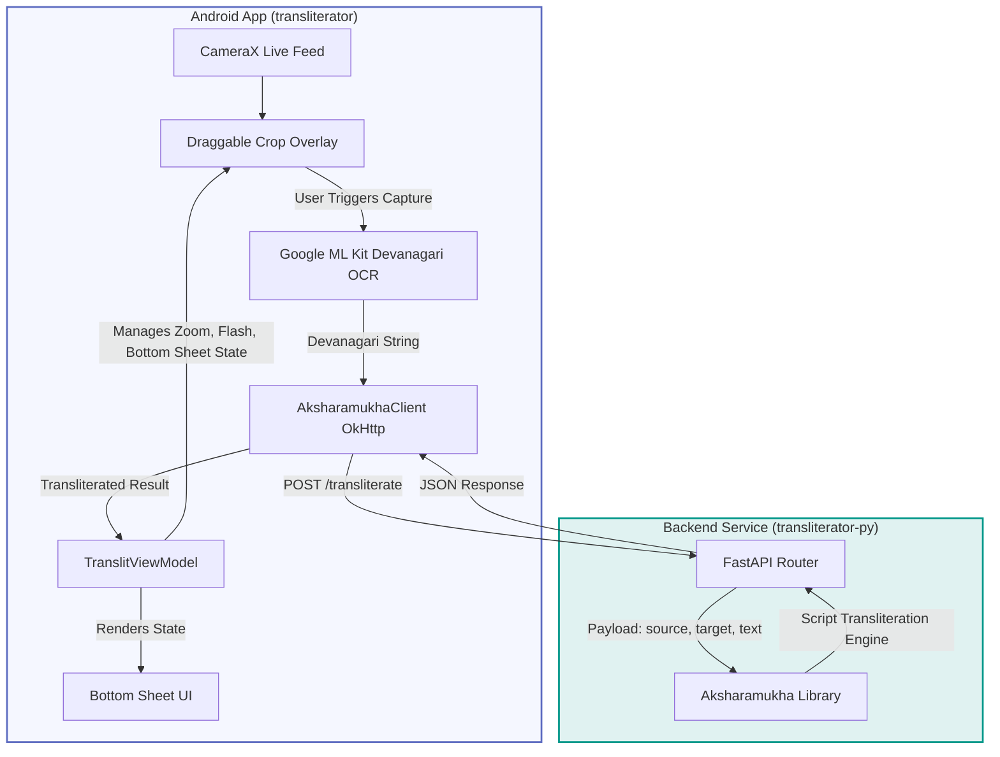

# Transliterator

[](https://kotlinlang.org)
[](https://developer.android.com)
[](https://fastapi.tiangolo.com)
[](https://opensource.org/licenses/MIT)

A modern, high-performance mobile-to-cloud transliteration tool designed for real-time text conversion between Indian languages and scripts. It features a responsive Android frontend powered by **Jetpack Compose**, **CameraX**, and **Google ML Kit (Devanagari OCR)**, integrated with a lightweight, scalable Python **FastAPI backend** running **Aksharamukha**.

---

## 🏗️ High-Level Architecture

The project bridges on-device camera capturing and script recognition with a remote transliteration engine via a RESTful API.



---

## 🛠️ Repository & Tech Stack

This workspace is divided into two primary components:

### 1. [Android Frontend (transliterator)](file:///c:/Users/ajith/Videos/Projects/transliterator/transliterator)
A native Android application written in **Kotlin** leveraging modern Jetpack Compose.
*   **UI/UX Framework:** Jetpack Compose (Material 3, Edge-to-Edge window inset design).
*   **Camera Integration:** CameraX (`camera-camera2`, `camera-lifecycle`, `camera-view`, and Compose Interop).
*   **OCR Engine:** Google ML Kit Text Recognition with specialized `DevanagariTextRecognizerOptions` for high-accuracy Devanagari script detection.
*   **Networking:** OkHttp client implementing asynchronous networking calls (`AksharamukhaClient`).
*   **Dependency Injection:** Dagger Hilt (`@HiltViewModel` VM injection, `@Inject` constructors).
*   **Specialized Components:** Draggable and resizable corner-handle `CropOverlay`, iOS-style preset zoom buttons, and a scroll-wheel `RotaryZoomSlider` for fine camera zoom.

### 2. [Python Backend (transliterator-py)](file:///c:/Users/ajith/Videos/Projects/transliterator/transliterator-py)
A lightweight API wrapper around the Aksharamukha script transliteration system.
*   **Framework:** FastAPI (including CORSMiddleware configuration for universal origin access).
*   **Alternate Engine:** Flask variant included for reference/legacy server deployment configurations.
*   **Engine:** `aksharamukha` library supporting script parsing and conversion (e.g., Devanagari ➔ Kannada).

---

## 🚀 Getting Started

Follow these steps to run both the backend service and the Android app locally for development.

### 1. Spin up the Backend (FastAPI)

1.  **Navigate to the backend directory and set up a Python virtual environment:**
    ```bash
    cd transliterator-py
    python -m venv .venv
    ```

2.  **Activate the virtual environment:**
    *   **Windows (PowerShell):**
        ```powershell
        .venv\Scripts\Activate.ps1
        ```
    *   **macOS / Linux:**
        ```bash
        source .venv/bin/activate
        ```

3.  **Install the requirements:**
    ```bash
    pip install -r requirements.txt
    # Install FastAPI and Uvicorn if not already installed
    pip install fastapi uvicorn
    ```

4.  **Launch the development server:**
    ```bash
    uvicorn trans:app --host 0.0.0.0 --port 8000
    ```
    The server will start on `http://localhost:8000`. You can inspect the interactive docs at `http://localhost:8000/docs`.

### 2. Build and Run the Android App

1.  Open the [transliterator](file:///c:/Users/ajith/Videos/Projects/transliterator/transliterator) folder directly in **Android Studio** (Koala or newer recommended).
2.  Allow Gradle to sync and fetch all dependencies defined in the Version Catalog (`gradle/libs.versions.toml`).
3.  Configure `AksharamukhaClient` if you wish to run against your local server instead of the deployed Render URL (currently pointing to `https://transliterator.onrender.com/transliterate`).
4.  Run on an emulator or physical device running **Android Oreo (API Level 28)** or above.
5.  Grant camera permissions on launch.

---

## 🤝 Contribution Guidelines

We welcome contributions to improve speed, add offline engines, or polish the UX.

1.  **Branching Policy:** Create feature branches from `main` (e.g., `feature/offline-ocr`).
2.  **Formatting:** Keep Kotlin code clean. Run Android lint checks before pushing.
3.  **Testing:**
    *   For backend: Write automated integration tests for script pairs.
    *   For frontend: Ensure changes do not break CameraX surface bindings or ML Kit frame processors.

---

## 🗺️ Roadmap

- [ ] **Offline OCR Fallback:** Integrate TensorFlow Lite (TFLite) or optimize Tesseract4Android usage to enable local OCR without network requests.
- [ ] **Dynamic Backend Failover:** Implement circuit-breaker or client-side retry strategies when the hosted Render deployment is cold-starting.
- [ ] **Expand Target Scripts:** Enable multi-language script selectors in the UI (currently defaulting to Devanagari ➔ Kannada).
- [ ] **Continuous Integration (CI):** Set up GitHub Actions to run Android unit/instrumentation tests and run FastAPI pytest suites.

---

## 📄 License

This project is licensed under the MIT License. See [LICENSE](LICENSE) for details.

